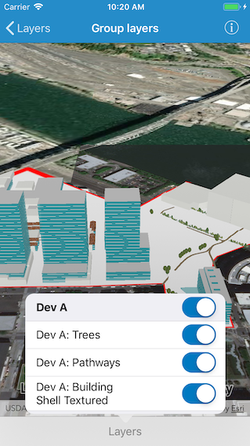

# Group layers

Group a collection of layers together and toggle their visibility as a group.

## Use case  

Group layers communicate to the user that layers are related and can be managed together.

In a land development project, you might group layers according to the phase of development.

## How it works

1. Create a new `AGSGroupLayer` object.
2. Add a child layer to the group layer's layers collection.
3. To toggle the visibility of the group, simply change the group layer's `isVisible` property.

## Relevant API

* `AGSGroupLayer`

## Additional information

The full extent of a group layer may change when child layers are added/removed. Group layers do not have a spatial reference, but the full extent will have the spatial reference of the first child layer.

Group layers can be saved to web scenes. In web maps, group layers will be flattened in the web map's operational layers.

## Tags

Layers, Group Layer
